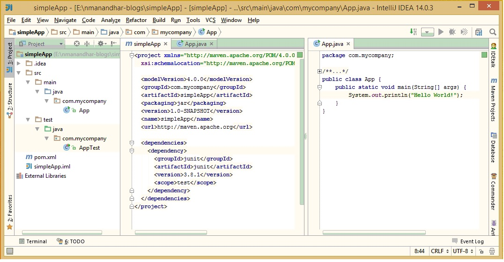

Compiling Aspects and Weaving with Maven
========================================

*   [Overview](#overview)
    *   [aspectj-maven-plugin](#plugin)
    *   [Html](#html)

###Overview
In this entry, we will create a simple java project, add a simple tracing aspect
to it and compile and weave using Maven. 

To get started quickly we will use maven archetype plugin to generate a simple Java Project.
In the command line type the following command

    mvn archetype:generate -DgroupId=com.mycompany -DartifactId=simpleApp -DarchetypeArtifactId=maven-archetype-quickstart -DinteractiveMode=false

This will generate the folder simpleApp in the current directory containing pom.xml and also create a sampl class named App. 
This class will simply print the classic hello world when run

The following figure shows the folder structure, contents of pom.xml and App.java
 

Change the pom.xml as shown below.
>*If you are not very familiar with Maven plugins the pom can be intimidating at 
first but know that it was added one at a time as needs arised. It was my initial idea to build the pom and the project
progressively, but the size of pom.xml repeated many times made the blog excessively long. You can copy and paste the pom
and use it throughout this blog, and also make it a sample for your own projects.*

----
pom.xml

    <project xmlns="http://maven.apache.org/POM/4.0.0" xmlns:xsi="http://www.w3.org/2001/XMLSchema-instance"
             xsi:schemaLocation="http://maven.apache.org/POM/4.0.0 http://maven.apache.org/maven-v4_0_0.xsd">

        <modelVersion>4.0.0</modelVersion>
        <groupId>com.mycompany</groupId>
        <artifactId>simpleApp</artifactId>
        <version>1.0-SNAPSHOT</version>
        <name>simpleApp</name>

        <properties>
            <mainClass>com.mycompany.App</mainClass>
            <aspectj.version>1.8.4</aspectj.version>
            <jdk-version>1.7</jdk-version>
        </properties>

        <dependencies>
            <!-- junit for unit testing-->
            <dependency>
                <groupId>junit</groupId>
                <artifactId>junit</artifactId>
                <version>3.8.1</version>
                <scope>test</scope>
            </dependency>
            <!-- AspectJ runtime library is required for Aspects -->
            <dependency>
                <groupId>org.aspectj</groupId>
                <artifactId>aspectjrt</artifactId>
                <version>${aspectj.version}</version>
            </dependency>
        </dependencies>

        <build>
            <plugins>
                <plugin>
                    <!-- The maven-assembly-plugin is used to here package the application
                     into a "fat" executable jar with all dependecies included. The jar will
                     be named simpleApp.jar and will be created in the project directory 
                     Alternatively you can also use maven-jar-plugin to create executable jar -->
                    <groupId>org.apache.maven.plugins</groupId>
                    <artifactId>maven-assembly-plugin</artifactId>
                    <executions>
                        <execution>
                            <phase>package</phase>
                            <goals>
                                <goal>single</goal>
                            </goals>
                            <configuration>
                                <finalName>simpleApp</finalName>
                                <outputDirectory>${project.basedir}</outputDirectory>
                                <appendAssemblyId>false</appendAssemblyId>
                                <descriptorRefs>
                                    <descriptorRef>jar-with-dependencies</descriptorRef>
                                </descriptorRefs>
                                <archive>
                                    <manifest>
                                        <mainClass>${mainClass}</mainClass>
                                    </manifest>
                                </archive>
                            </configuration>
                        </execution>
                    </executions>
                </plugin>
                <!-- Not required. However we are creating a fat jar with maven-assembly-plugin. 
                This results in two jars being created one by assembly plugin and one by jar plugin
                By setting the phase to an nonexistant phase , we avoid creating a jar with the 
                jar plugin when we package the application -->
                <plugin>
                    <groupId>org.apache.maven.plugins</groupId>
                    <artifactId>maven-jar-plugin</artifactId>
                    <version>2.4</version>
                    <executions>
                        <execution>
                            <id>default-jar</id>
                            <phase>none</phase>
                        </execution>
                    </executions>
                </plugin>
                <plugin>
                    <groupId>org.apache.maven.plugins</groupId>
                    <artifactId>maven-compiler-plugin</artifactId>
                    <version>3.1</version>
                    <configuration>
                        <source>1.7</source>
                        <target>1.7</target>
                    </configuration>
                </plugin>
                <!-- The aspectj-maven-plugin is used to compile and weave aspects
                 Since we are using a newer version of aspectj runtime we also set
                 the dependency for a newer version of aspectjtools -->
                <plugin>
                    <groupId>org.codehaus.mojo</groupId>
                    <artifactId>aspectj-maven-plugin</artifactId>
                    <version>1.7</version>
                    <configuration>
                        <showWeaveInfo>true</showWeaveInfo>
                        <outxml>false</outxml>
                        <complianceLevel>${jdk-version}</complianceLevel>
                        <source>${jdk-version}</source>
                        <target>${jdk-version}</target>
                        <!--<aspectDirectory>src/main/aspect</aspectDirectory>-->
                        <!--<XterminateAfterCompilation>true</XterminateAfterCompilation>-->
                    </configuration>
                    <executions>
                        <execution>
                            <goals>
                                <goal>compile</goal>
                            </goals>
                        </execution>
                    </executions>
                    <dependencies>
                        <dependency>
                            <groupId>org.aspectj</groupId>
                            <artifactId>aspectjtools</artifactId>
                            <version>${aspectj.version}</version>
                        </dependency>
                    </dependencies>
                </plugin>
                <!-- The exec-maven-plugin is used here to run java programs without
                     packaging the application.-->
                <plugin>
                    <groupId>org.codehaus.mojo</groupId>
                    <artifactId>exec-maven-plugin</artifactId>
                    <version>1.4.0</version>
                    <configuration>
                        <mainClass>${mainClass}</mainClass>
                    </configuration>
                </plugin>
            </plugins>
        </build>
    </project>
----

In order to test our aspects, we will create a simple class called Point. A Point represents
a point in 2D space. It can be moved to a new location, and displaced. A Point also supports
the notion of a length, which is the distance of the point from the origin(0,0)

**SideNote**
>*The Point class and the App class was initially more substantial than that which is shown here
However fearing that the code would interfere with the true purpose of this blog post, which is
to show how to weave aspects rather, it was simplified. 
 **Also note that for brevity the getters and toString() method have been ommited.***

Point.java

    package com.mycompany;
    import java.util.concurrent.TimeUnit;

    public class Point {
        private int x;
        private int y;

        public Point(int x, int y) { this.x = x; this.y = y; }

        public void moveTo(int newX, int newY) {
            this.x = newX;
            this.y = newY;
        }

        public void displace(int delX, int delY) {
            this.x += delX;

            this.y += delY;
        }

        public double getLength() {
            return Math.sqrt(Math.pow(x, 2) + Math.pow(y, 2));
        }
    }

App.java

    package com.mycompany;

    public class App {
        public static void main(String[] args) {
            Point pointA = new Point(5, 5);
            pointA.moveTo(10, 20);
            pointA.displace(20, 0);
            System.out.println("The length of " + pointA + " is " + pointA.getLength());
        }
    }

###Experimenting with Ajc Compiler ###

Now that we have a sample project, let's say we are debugging the application and want to log all invocation of public method of the Point class. 
In folder src/main/aspect/com/mycompany/aspects create the following aspect (in traditional syntax) to log execution of all public methods of the
Point class

LoggingAspect.java

    package com.mycompany.aspects;

    import org.aspectj.lang.JoinPoint;

    public aspect LoggingAspect {
        pointcut pointPublicMethods(): execution( * com..Point.*(..));

        before(): pointPublicMethods(){
            //in read production code, we would use an actual logger using logging framework like log4j
            System.out.println("Executing method " + getFullMethodSignature(thisJoinPoint));
        }

        private String getFullMethodSignature(JoinPoint joinPoint) {
            String className = joinPoint.getTarget().getClass().getSimpleName();
            String methodName = joinPoint.getSignature().getName();
            Object[] args = joinPoint.getArgs();
            int argumentLength = args.length;

            StringBuilder sb = new StringBuilder();

            sb.append(className).append(".").append(methodName).append("(");
            for (int i = 0; i < argumentLength; i++) {
                sb.append(args[i]);
                if (i < argumentLength - 1) sb.append(" , ");
            }
            sb.append(")";

            return sb.toString();
        }
    }

 

    Now run the main method of App.java from the IDE or in the command line type 
    $ mvn compile exec:java 
    Output:
    [INFO] Showing AJC message detail for messages of types: [error, warning, fail]
    [INFO] Join point 'method-execution(void com.mycompany.Point.moveTo(int, int))' in Type 'com.mycompany.Point' (Point.java:15) advised by before advice from 'com.mycompany.aspects.LoggingAspect' (LoggingAspect.aj:8)
    [INFO] Join point 'method-execution(void com.mycompany.Point.displace(int, int))' in Type 'com.mycompany.Point' (Point.java:20) advised by before advice from 'com.mycompany.aspects.LoggingAspect' (LoggingAspect.aj:8)
    [INFO] Join point 'method-execution(int com.mycompany.Point.getX())' in Type 'com.mycompany.Point' (Point.java:25) advised by before advice from 'com.mycompany.aspects.LoggingAspect' (LoggingAspect.aj:8)
    [INFO] Join point 'method-execution(int com.mycompany.Point.getY())' in Type 'com.mycompany.Point' (Point.java:29) advised by before advice from 'com.mycompany.aspects.LoggingAspect' (LoggingAspect.aj:8)
    [INFO] Join point 'method-execution(double com.mycompany.Point.getLength())' in Type 'com.mycompany.Point' (Point.java:33) advised by before advice from 'com.mycompany.aspects.LoggingAspect' (LoggingAspect.aj:8)
    [INFO] Join point 'method-execution(java.lang.String com.mycompany.Point.toString())' in Type 'com.mycompany.Point' (Point.java:38) advised by before advice from 'com.mycompany.aspects.LoggingAspect' (LoggingAspect.aj:8)

    Executing method Point.moveTo(10 , 20)
    Executing method Point.displace(20 , 0)
    Executing method Point.toString()
    Executing method Point.getLength()
    The length of Point [ 30 , 20 ] is 36.05551275463989

Because we have enabled the showWeaveInfo in aspectj-maven-plugin, the output shows all the weaved join points. In particular we see that all the public methods are 
weaved.Examining the output we see that we have indeed logged every public method execution of Point class. But what actually happened here?
When we run compile, the aspectj-compiler compiles the aspect LoggingAspect.aj, and weaves the before advice to the Point methods.

  

Looking at the compiled LoggingAspect class, we see that it consist of a singleton instance, initialized at classloading time  , and method for the before adivce, which
is called by each of the public methods before performing their usual business logic.
[todo] add dot file diagram

##DYI Compilation and Weaving
Using Maven or IDE for compilation and weaving is good and what you would use in practise. But it helps to know what is happening by actually doing every step yourself.
In this section we will perform all the steps ourself. You can skip this section and goto next section.

Steps required
* Compile your program [using ajc or javac]
* Compile your aspect using Ajc
*

Lets first compile our program. In this section we will use ajc.
In the command prompt cd to the project root, and type 
$>ajc ajc src\main\java\com\mycompany\App.java
You will get an error that "Point cannot be resolved to a type"

This is because the App.java uses the class Point the compiler could not resolve. You can either
  1. Include all the source files in the command line
    >ajc -source 1.7 -target 1.7 src\main\java\com\mycompany\*.java 
    It compiles succesfully and the compiled class files are placed next to the source.
    >
    >Putting the output in a differnt folder.
    >Since the above command puts all the .class files in the source folder, it is a bit unwiedly. Lets put them in a different directory.Say target as maven does.
    ajc -d target -source 1.7 -target 1.7 src\main\java\com\mycompany\*.java src\main\java\com\mycompany\math\*.java

    
    

  2. Use the sourcepath option to indicate to the compiler where to search for unresolved types.
