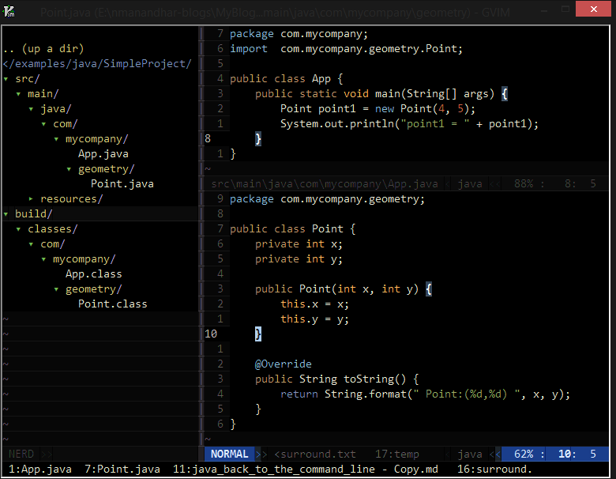

#Java: Back to the Command Line

Introduction
============

> * It takes less time to become an expert than to remain a novice*

For those of us who started programming Java using IDE's or even build tools
like Maven, the process of compiling a Java program, creating executable jar
files may seem esoteric. Morever even though we have a vague sense of terms like
classpath,sourcepath etc is, we have a vague nagging sensation that we really
don't know what they signify. The purpose of this blog is to understand these
terms, create a working executable jar file forfeiting the comforts of the IDE.
We will take a scientific approach, formulate hypothesis ,design experiments and
come to a conclusion. *So are you ready to go back to the command line
##Naming Java source files

In case you are completely new to Java, here are some basic rules for naming
java source files

* Source code names must have the extension java. ie javac compiler will refuse
    to compile your java source files if they have any other extentions even if
    they are perfectly valid.

* Compiled byte code must have .class extention.

* All public classes must be defined in a file with the same name as the name of
    the class. ie  a public class name Point, must be defined in Point.java. This
    also implies that a java source file cannot contain two public classes.

* The source files should be kept in a directory tree that reflects their package
    tree. ie if we keep all source files in sourceFiles directory, then a class
com.mycompany.Point.java should be placed in sourceFiles\com\mycompany\Point.java 

 
  
 

However if you are defining a package private class the name of the file is
allowed to be different from the name of the class

##The Setup

In order to solve any problem, it is essential to reduce its complexity to the
bare minimum so that we are not distracted by extraneous factors. 

In order to experiment with compiling Java, we will create a very simple project. 
We will  follow a folder structure similar to the folder structure of Maven.
All our source files will be placed inside src\main\java directory of our project 
folder SimpleProject.

> Why `src\main\java?`
  
There is no intrinsic reason why we decided to place all our java files in the
folder src\main\java. For this experiment, the source files can be placed anywhere. 
However placing java files in src\main\java is a well known convention popularized by
the ubiqutous maven build system. Placing our source files in src\main\java
means we can seperate our test classes, source classes, other non java source
codes eg groovy. The usual maven configuration is shown below
>
* Main Project Folder
  * src
    * main
      * java 
            --> this is where we place all our java source files
      * groovy 
            --> this is where we place all our groovy source files
      * scala 
            --> this is where we place all our scala source files
      * resources 
            --> this is where we place all our resource files
    * test
      * java --> this is where we place all our test files
      * resources --> this is where we place all our test resource files
  * pom.xml --> this file describes our project,its dependencies and so on
>
Organizing our code in this way makes sense because we can seperate our test
classes from the code, separate java from non java code and so on. If you decide
to use this configuration in Maven, things will work a lot smoother than if you
decide to come up with your own folder structure. However after completing this
blog you should be able to organize your project in any format you desire

 
  
 

## Compiling the project.

In order the run the program we need to first compile it using [javac](http://docs.oracle.com/javase/7/docs/technotes/tools/windows/javac.html) 
>The javac tool reads class and interface definitions, written in the Java programming language, and compiles them into bytecode class files. It can also process annotations in Java source files and classes.
By default, the compiler puts each class file in the same directory as its source file. You can specify a separate destination directory with -d (see Options, below)

    $> javac -help
    Usage: javac <options> <source files>
    where possible options include:
      -verbose                   Output messages about what the compiler is doing
      -classpath <path>          Specify where to find user class files and annotation processors
      -cp <path>                 Specify where to find user class files and annotation processors
      -sourcepath <path>         Specify where to find input source files
      -d <directory>             Specify where to place generated class files
      -s <directory>             Specify where to place generated source files
      -encoding <encoding>       Specify character encoding used by source files
      -source <release>          Provide source compatibility with specified release
      -target <release>          Generate class files for specific VM version
      @<filename>                Read options and filenames from file
      -help                      Print a synopsis of standard options

 

Let's see if we can get our simple project to compile.

    SimpleProject$>javac src\main\java\com\mycompany\App.java
    src\main\java\com\mycompany\App.java:2: error: package com.mycompany.geometry does not exist
    import  com.mycompany.geometry.Point;
                                  ^
    src\main\java\com\mycompany\App.java:7: error: cannot find symbol
            Point point1 = new Point(4, 5);
            ^
      symbol:   class Point
      location: class App
    src\main\java\com\mycompany\App.java:7: error: cannot find symbol
            Point point1 = new Point(4, 5);
                               ^
      symbol:   class Point
      location: class App
    3 errors

>When compiling a source file, the compiler often needs information about a type
whose definition did not appear in the source files given on the command line.
The compiler needs type information for every class or interface used, extended,
or implemented in the source file. This includes classes and interfaces not
explicitly mentioned in the source file but which provide information through inheritance

When we ran `javac src\main\java\com\mycompany\App.java` , we told the javac
compiler to compiler the class App.java. But the App.java class references the Point
class. The compiler doesn't know anything about the Point class and thus cannot
proceed further with compiling the class.
In order to tell the compiler about the Point class, we can pass the Point.java
file along with App.java

    SimpleProject>javac src\main\java\com\mycompany\App.java src\main\java\com\mycompany\geometry\Point.java

The compiler does not emit any error messages, so compilation must have
completed succesfully. If you look at the folders where java files are
located you should see the compiled class files, along side the java file.

        SimpleProject/
            ▾ src/
              ▾ main/
                ▾ java/
                  ▾ com/
                    ▾ mycompany/
                      ▾ geometry/
                          Point.class   <-- compiled class files
                          Point.java
                        App.class       <-- compiled class files
                        App.java
                ▾ resources/
                  ▾ META-INF/
                    log4j.jroperties
  

We got our very simple project to compile but passsing all the java files to the
compiler on the command line is painful for anything but very very simple project.
Any respectable java program is likely to have hundreds of source files arranged
in directories. Listing all the source files is not practical

Javac allows another way we can pass the list of java source files. We can list
all the source files in a seperate file and pass that file instead of passing
all the files on the command line.

Create a file in the root project folder, and name it sourceFiles.txt( or any
name of your choosing ) and list all the source files on the file. 

    ::cmd
    SimpleProject>cat sourceFiles.txt
    src\main\java\com\mycompany\App.java
    src\main\java\com\mycompany\geometry\Point.java

  

    ::side note Creating a list of java files using vim
    ::vim
    :let @"=expand("src/**/*.java")
    ^ get all java files and put it in paste buffer register 0

    :edit sourceFiles.txt
    ^ open a new file sourceFiles.txt

    Now press p to paste the listing of the java files
    :w

  

Now lets try compiling javac by passing our source files using a file

    SimpleProject> javac @sourceFiles.txt

Once again it should compile succesfully. However you probably found
listing the source files in a seperate file no better than listing them on
the command line. Windows users find listing the files quite difficult
compared to linux/unix users. Source code keeps changing requring you to
continually update the sourceFiles listing. Things souldn't be so difficult
and and it isn't.
     
Let's revisit our original problem. We want to compile the App.java class, and
since App.java reference another class Point, the compiler could not find the
source for the Point.java class

##Be the compiler

Ok let's be a compiler for a moment. We get a request to compile a class. We
happily munch off at the problem until we encounter the class
com.mycompany.geometry.Point. What do we do now? Let's use our knowledge again.
We have arranged to put all our source files under src\main\java folder, so the
definition of the Point must be somewhere there. Also any class in the package
com.mycompany.geometry must be in the com/mycompany/geometry folder. With
these two piece of information, we can say that we can find the class Point.java
in src/main/java/com/mycompany/geometry folder. Ok we can figure out the
location of any java class we have in our source code, so why can't the
compiler?

The issue is that the compiler lacks one piece of knowledge that we have- where
all the source files reside. The decision to put our source files under
src/main/java was an arbitrary decision on our part that the compiler knows
nothing about. If we could only tell the compiler where we decided to place our
source, the compiler could figure out the source location based on this
informationa and the package. 

The javac compiler accepts a -sourcepath option that does exactly this thing.
Whenever the compiler encounters an unknown class definition, it will search for
the class file starting with the sourepath we supplied

Let's try running with the sourcepath option

        :::cmd
        SimpleProject>javac -sourcepath src\main\java src\main\java\com\mycompany\App.java

It compiles. Now no matter how many classes we have, we don't have to explictly
list them, the compiler does the little extra work we were doing a few steps
back.If you are tired of typing src\main\java, cd to that directory and then try
again

    :::cmd
    SimpleProject>cd src\main\java
    SimpleProject\src\main\java> javac -sourcepath . com\mycompany\App.java

This should work again. Notice that we are passing `.` as argument to sourcepath.
The `.` represents the current working directory. Also if when you are in the
src\main\java, the following might also work (depending on your classpath
settings)

    :::cmd
    SimpleProject>cd src\main\java
    SimpleProject\src\main\java> javac com\mycompany\App.java

This is because of classpath settings(something that is very important and will
talk about later)

##Seperating the Compiled Files from Source Files

We are now able to compile our classes without any problem but if you looked at
the result of compilation , the compiled .class files are placed in the same
location as the source files.

In general we don't want compiled class files to be mixed with the source files
files. First it clutters up the source file directory with class files. Morever
the source files should be under version control while compiled class should
not. Also it will later make it easy to package our application . Thus it would
be preferable to have our compiled class be placed in a seperate directory We can 
tell the javac compiler to place the compiled classes in a different directory 
using the -d option and passing the folder where we want to place the
compiled classe. `Note:The output directory must exist.`

Let's put all our compiled classes inside SimpleProject\build\classes folder
:::cmd
SimpleProject>mkdir build\classes
SimpleProject> javac -d build\classes -sourcepath src\main\java src\main\java\com\mycompany\App.java

This will compile the classes and place all the compiled class files inside the build\classes folder.

    SimpleProject/
        ▾ src/
          ▾ main/
            ▾ java/
              ▾ com/
                ▾ mycompany/
                    App.java
                  ▾ geometry/
                      Point.java
            ▸ resources/
        ▾ build/
          ▾ classes/
            ▾ com/
              ▾ mycompany/
                  App.class
                ▾ geometry/
                    Point.class

Now all our compiled class files are placed inside the folder
build\classes folder as shown. Also note that the folder structure of the output
class files mirrors the package structure of the classes.

## Running the program

We now have seen multiple options for compiling our java files.

    Lets try running our program
    SimpleProject>java com.mycompany.App
    Error: Could not find or load main class com.mycompany.App
    SimpleProject>java -classpath src\main\java com.mycompany.App
    point1 =  Point:(4,5)

    Voila our program finally runs when we pass in the claspath.

    Let's try another experiment. Change the current directory to src\main\java
    SimpleProject> cd src\main\java
    SimpleProject\src\main\java> java com.mycompany.App
    point1 =  Point:(4,5)

Holy Moly!!!. When we run the application from src\main\java our program runs without having to provide the classpath. [Note if your program still does not run 
don't worry. You will be able to figure out why by the end of this blog]

Ok let's recap. We know that we need to pass all the java source files on the command line or javac will complain. Wait... that's not entirely true. Let's try another
experiment.

If you are not already inside src\main\java change cd to the directory.
SimpleProject\src\main\java> javac com\mycomapny\App.java

>By default the compiler puts each class file in the same directory as its
source file. You can specify a seperate destination with -d

This time the program compiles again without having to provide all the java files on the command line. That's very reassuring indeed, however we would like to compile
and run our program from the Project folder and avoid having to change directory to src\main\java everytime. Also if you noticed, all the compiled classes are placed
in the same directory as the source files. We would like to put the compiled classes in a seperate folder. After all, we would put source file in a version control
while we should not put the compiled classes in version control and having them in the same directory clutters up the source directory and increases the changes
that we mistakenly commit the files.

Ok let's do it the way it should be done

    SimpleProject>mkdir target
    SimpleProject>javac -sourcepath src\main\java -d target src\main\java\com\mycompany\App.java
    SimpleProject>java -cp target com.mycompany.App
    point1 =  Point:(4,5)

## Solving the classpath puzzle

>###Observation 1
If you do not specify a sourcepath, the compiler uses the classpath to search
If you specify a sourcepath, however the compiler will not search in the classpath. Thus
if you specify the correct path in classpath but the specified sourcepath is wrong
compiler error ensues

##Source Path
When compiling a source file, the compiler often needs information about a type it does not yet recognize.
For eg when compiling App.java, the compiler encounters the class Point that
it does not know about. The compiler must then find the file where the class Point
is defined. How does the compiler know where to find the java file defining
the class Point.

Well the short answer is that the compiler does not actually know the exact
file but it has some idea of where it might find the file and starts searching
in those location until it finds a definition for the file

