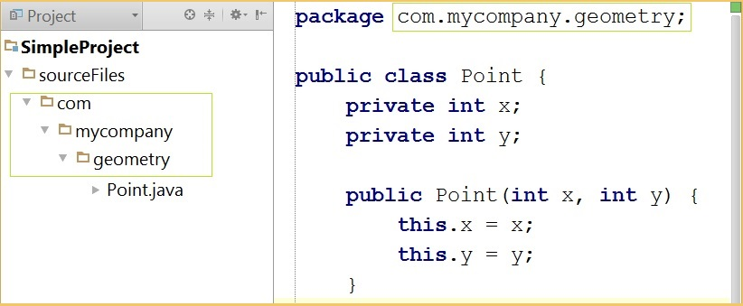

#Java: Back to the Command Line
    > *It takes less time to become an expert than to remain a novice*
    skld:

#TOC
* [Introduction](#introduction)
* [The Basics](#the-basics)
* [Naming Java Source files](#naming-java-source-files)

##Introduction   
For those of us who started programming Java using IDE's or even build tools like Maven, the process of compiling a Java program, creating executable jar files may 
seem esoteric. Moreover even though we have a vague sense of terms like classpath,sourcepath etc is, we have a vague nagging sensation that we really dont know
what they signify. The purpose of this blog is to understand these terms, create a working executable jar file forfeiting the comforts of the IDE. We will take
a scientific approach, formulate hypothesis ,design experiments and come to a conclusion. *So are you ready to go back to the command line ?*

##The Basics  

Just for the sake of completeness, we will start with the basics. Java is an OO language

##Naming Java source files  

In case you are completely new to Java, here are some basic rules for naming java source files
* Source code names must have the extension java. ie javac compiler will refuse to compile your java source files if they have any other extentions even if they are perfectly valid
* Compiled byte code will have and must have .class extention.
* All public classes must be defined in a file with the same name as the name of the class. ie  a public class name Point, must be defined in Point.java. This
also implies that a java source file cannot contain two public classes.
* The source files should be kept in a directory tree that reflects their package tree. ie if we keep all source files in sourceFiles directory, then a class com.mycompany.Point.java should
be placed in sourceFiles\com\mycompany\Point.java 
 
  
 

However if you are defining a package private class the name of the file is allowed to be different from the name of the class.
##The Setup  

In order to experiment with compiling Java, we will create a very simple project. We will  follow a folder structure similar to the folder structure of Maven.
All our source files will be placed insider src\main\java directory of our project folder SimpleProject.

* SimpleProject
  * src
    * main
      * java
          * com
              * mycompany
                * App.java 
                * geometry
                  * Point.java 
      * resources

    com.mycompany.geometry.Point.java

    package com.mycompany.geometry;

    public class Point {
        private int x;
        private int y;

        public Point(int x, int y) {
            this.x = x;
            this.y = y;
        }

        @Override
        public String toString() {
            return String.format(" Point:(%d,%d) ", x, y);
        }
    }

 

    com.mycompany.App.java

    package com.mycompany;
    import  com.mycompany.geometry.Point;

    public class App {

        public static void main(String[] args) {
            Point point1 = new Point(4, 5);
            System.out.println("point1 = " + point1);
        }
    }

## Compiling the project.  

In order the run the program we need to first compile it using [javac](http://docs.oracle.com/javase/7/docs/technotes/tools/windows/javac.html) 
>The javac tool reads class and interface definitions, written in the Java programming language, and compiles them into bytecode class files. It can also process annotations in Java source files and classes.
By default, the compiler puts each class file in the same directory as its source file. You can specify a separate destination directory with -d (see Options, below)

    $> javac -help
    Usage: javac <options> <source files>
    where possible options include:
      -verbose                   Output messages about what the compiler is doing
      -classpath <path>          Specify where to find user class files and annotation processors
      -cp <path>                 Specify where to find user class files and annotation processors
      -sourcepath <path>         Specify where to find input source files
      -d <directory>             Specify where to place generated class files
      -s <directory>             Specify where to place generated source files
      -encoding <encoding>       Specify character encoding used by source files
      -source <release>          Provide source compatibility with specified release
      -target <release>          Generate class files for specific VM version
      -help                      Print a synopsis of standard options

 

Let's see if we can get our simple project to compile.

    SimpleProject$>javac src\main\java\com\mycompany\App.java
    src\main\java\com\mycompany\App.java:2: error: package com.mycompany.geometry does not exist
    import  com.mycompany.geometry.Point;
                                  ^
    src\main\java\com\mycompany\App.java:7: error: cannot find symbol
            Point point1 = new Point(4, 5);
            ^
      symbol:   class Point
      location: class App
    src\main\java\com\mycompany\App.java:7: error: cannot find symbol
            Point point1 = new Point(4, 5);
                               ^
      symbol:   class Point
      location: class App
    3 errors

>When compiling a source file, the compiler often needs information about a type whose definition did not appear in the source files given on the command line. The compiler needs type information for every class or interface used, extended, or implemented in the source file. This includes classes and interfaces not explicitly mentioned in the source file but which provide information through inheritance

In our case, when compiling App.java, the compiler encountered the class com.mycompany.geometry.Point class of which it knows nothing about. It tries searching for a definition of class Point and faling that emits error message and quits. At this point we have a couple of options to get the code compiling.

* Pass all the source file definition when compiling.

      SimpleProject>javac src\main\java\com\mycompany\App.java src\main\java\com\mycompany\geometry\Point.java

  Here we have passed the location of Point.java class along with App.java .This is a viable option for compiling very small projects, such as this test setup.

* List the classes in a file and pass it as parameter for javac 

     Create a file "classes.txt" with the location of all java source files relative to the current directory

      SimpleProject> cat classes.txt
      src\main\java\com\mycompany\App.java
      src\main\java\com\mycompany\geometry\Point.java

      SimpleProject> javac @classes.txt

  Once again creating a list of all the java source files is a bit clumsy, especially on the Windows platform. Unix users can easily create such list using tools such as find and pipe the result to a file. 

* Use the classpath and sourcepath to help the compiler find the source file itself.

    Passing every source file to the compiler is not an effective solution. It is clumsy at best and results in compilation of classes that is not used by any classes. With a little help from us, the compiler can find the sourcefile for classes. The compiler knows that a public class will be defined in a file of the same name and its folder structure mirrors the package that the class is defined in. For eg when it encounters the class com.mycompany.geometry.Point class, it knows that it will be named Point.java and will be located in folder com\mycompany\geometry in some folder.If we can provide some
    hint to the compiler where to search for source file , the compiler can figure out the actual source file itself.

The way we can tell the compiler where to start looking for types that it does not yet know about is through two parameters the classpath and the sourcepath.

#Sourcepath
the -sourcepath option tells javac where to find source files, besides the ones passed on the command line. The sourcepath option accepts a list of folders
where javac should search for source files of types it does not know about. The list of folders are seperated by ; in Windows and : in Unix/Linux 
(todo verify for Linux)
[todo] When javac encounters an unknown type, should it look for its source or should it look for any compiled class files.
#Classpath
The classpath ( or the class search path)  is the path the the Java runtime environment searches for classes and other resource files.
The classpath can be set using the -classpath / -cp option when calling a 
JDK tool( java/javac/javadoc/apt), or by setting the CLASSPATH environment variable.
The -classpath option is preferred because you can set it individually
for each application without affecting other application or without other 
applications modifying its value.
  The classpath=classpath1;classpath2;.. where each classpath entry will be
  either the location of jar/zip file containg .class files of compiled library 
  code, or the directory containing the root package ( the first package in 
  the full package name). Include a picture here
  * a jar/zip file containing .class files.
  * a directory that contains the "root" package ( the first package in the 
  * full package name)

      *The default classpath is the current directory*. Setting the CLASSPATH
      variable or using the -classpath command line option overrides the default,
      so if you want to include the current directory in the search path
      you must include . in the new settings
      eg set classpath=someDir;.  <-- Notice the . to include the current directory in the classpath

      Searching for classes
      The java launcher, java, initiates the Java virtual machine. The virtual
      machine searches for and loads classes in the order
       1. Bootstrap classes. - Classes that comprise the Java platform, including
       the rt.jar, and several other important jar files
       2. Extentsion classes ?
       3. User classes: Classes defined by developers and third parties that
       do not take advantage of the extension mechanism. You identify the
       location of these classes using the -classpath option on command line
       or the CLASSPATH environment variable.

       >> In general, you only have to sepecify the location of user classes
       .Bootstrap classes and extension classes are found automatically.

       How the Java Launcher finds Bootstrap Classes
       Bootstrap classes are in rt.jar and several other jar files in the 
       jre/lib. The rt.jar contains class files for the core Java classes such
       as java.util.String, java.lang.Integer etc. These archives are specified 
       in the system property sun.boot.class.path. Lets check the value of 
       this property

Lets write a simple class that will print out its value. For simplicity, I placed
this class in SimpleProject, and the class has the default package.

    public class Test {
        public static void main(String[] args) {
            System.out.println("System property sun.boot.class.path  = " + System.getProperty("sun.boot.class.path"));
        }
    }

    SimpleProject> javac Test.java 
    SimpleProject> java Test 
    System property sun.boot.class.path  = 
    C:\Program Files\Java\jre7\lib\resources.jar;C:\Program Files\Java\jre7\lib\rt.jar;C:\Program Files\Java\jre7\lib\sunrsasign.jar;C:\Program Files\Java\jre7\lib\jsse.jar;C:\Program Files\Java\jre7\lib\jce.jar;C:\Program Files\Java\jre7\lib\charsets.jar;C:\Program Files\Java\jre7\lib\jfr.jar;C:\Program Files\Java\jre7\classes

Note that the classes which implement the Java SDK are in a separate archive
from bootstrap clases. The tools archive is SDK's/lib/tools.jar. The development
tools add this archive to user class path when invoking the launcher,.However
this augmented user class path is only used to execute the tool. The tools
process source code, javac and javadoc, use the original class path and not 
the augmented version.

> ##How the Java Launcher Finds User Classes  

>To find user classes, the launcher refers to the user class path -- a list of directories, JAR archives, and ZIP archives which contain class files.
>
> A class file has a subpath name that reflects the class's fully-qualified name. For example, if the class com.mypackage.MyClass is stored under /myclasses, then /myclasses must be in the user class path and the full path to the class file must be /myclasses/com/mypackage/MyClass.class. If the class is stored in an archive named myclasses.jar, then myclasses.jar must be in the user class path, and the class file must be stored in the archive as com/mypackage/MyClass.class.
The java launcher puts the user class path string in the java.class.path system property. 
The possible sources of this values are
1. The default value "." meaning that user class files are all the class
files in the current directory (or under it if in package)
1. The value of the CLASSPATH environment variable, which overrides the default
value
1. The value of -cp or -classpath command line option which overrides both the default value and the CLASSPATH value.
1. The Jar archive specified by the -jar option, which overrides all other values. If this option is used,
all user classes must come from the specified archive.

Note that when -jar is used to run an executable jar file, all classpath set from
environment variable or command line are ignored. This can sometimes be counter intuitive
so be sure to try it out yourself

How Javac and JavaDoc Find Classes

The javac and javadoc tools use class files in two distinct ways
 * Likeany Java application,javac and javadoc must load various class files  in order to running
 * To process the source code they operate on, javac and javadoc must obtain information on object types used In
 the source code.

The class files used to resolve source code references are mostly the same class files used to run javac and javadoc
But there are important exceptions.

* Both javac and javadoc often resolve references to classes and interfaces that 
have nothing to do with the implementation of javac or javadoc. *Information on 
referenced user classes and interfaces may be present in the form of class files,
source files or both.
* The tools classes in tools.jar are only used to run javac and javadoc. The tools
classes are not used to resolve source code references unless tools.jar is In
the user class path.
* A programmer may want to resolve boot class or extension class references
using an alternative Java platform implementation. Both javac and javadoc support
this with their -bootclasspath and -extdir options. Use of these options does
not modify the set of class files used to run javac or javadoc tools themselves.

If a referenced class is defined in both a class file and source file, javadoc
always uses the source file. In the same situation javac uses class files but
automatically recompiles any class files it determines to be out of date

By default, javac and javadoc search the user class path for both class files and
source files. If the -sourcepath option is specified, javac and javadoc search 
for the source files only on the specified source file path, while still searching
for user class path for class files

##Hypothesis  

When javac needs to resolve a unknown type, it first searches for its source and compiles the source if it finds one. If it does not find the source, it searches
for the compiled class files and uses it.
###Experiment:  

Put both source and compiled class files on the classpath. If source is available, it should be compiled. Verify by checking the timestamp of the compiled class.
Remove the source file and only keep the compiled class file, the compilation should still succeed.

In order to make this work we have to pass all the source files in one invocation. Back to the command line

    The compiler does not emit any error messages, so compilation must have completed succesfully.
    Lets try running our program
    SimpleProject>java com.mycompany.App
    Error: Could not find or load main class com.mycompany.App

    SimpleProject>java -classpath src\main\java com.mycompany.App
    point1 =  Point:(4,5)

    Voila our program finally runs when we pass in the claspath.

    Let's try another experiment. Change the current directory to src\main\java
    SimpleProject> cd src\main\java
    SimpleProject\src\main\java> java com.mycompany.App
    point1 =  Point:(4,5)

Holy Moly!!!. When we run the application from src\main\java our program runs without having to provide the classpath. [Note if your program still does not run 
don't worry. You will be able to figure out why by the end of this blog]

Ok let's recap. We know that we need to pass all the java source files on the command line or javac will complain. Wait... that's not entirely true. Let's try another
experiment.

If you are not already inside src\main\java change cd to the directory.
SimpleProject\src\main\java> javac com\mycomapny\App.java

>By default the compiler puts each class file in the same directory as its
source file. You can specify a seperate destination with -d

This time the program compiles again without having to provide all the java files on the command line. That's very reassuring indeed, however we would like to compile
and run our program from the Project folder and avoid having to change directory to src\main\java everytime. Also if you noticed, all the compiled classes are placed
in the same directory as the source files. We would like to put the compiled classes in a seperate folder. After all, we would put source file in a version control
while we should not put the compiled classes in version control and having them in the same directory clutters up the source directory and increases the changes
that we mistakenly commit the files.

Ok let's do it the way it should be done

    SimpleProject>mkdir target
    SimpleProject>javac -sourcepath src\main\java -d target src\main\java\com\mycompany\App.java
    SimpleProject>java -cp target com.mycompany.App
    point1 =  Point:(4,5)

## Solving the classpath puzzle

>###Observation 1
If you do not specify a sourcepath, the compiler uses the classpath to search
If you specify a sourcepath, however the compiler will not search in the classpath. Thus
if you specify the correct path in classpath but the specified sourcepath is wrong
compiler error ensues

##Source Path
When compiling a source file, the compiler often needs information about a type it does not yet recognize.
For eg when compiling App.java, the compiler encounters the class Point that
it does not know about. The compiler must then find the file where the class Point
is defined. How does the compiler know where to find the java file defining
the class Point.

Well the short answer is that the compiler does not actually know the exact
file but it has some idea of where it might find the file and starts searching
in those location until it finds a definition for the file

