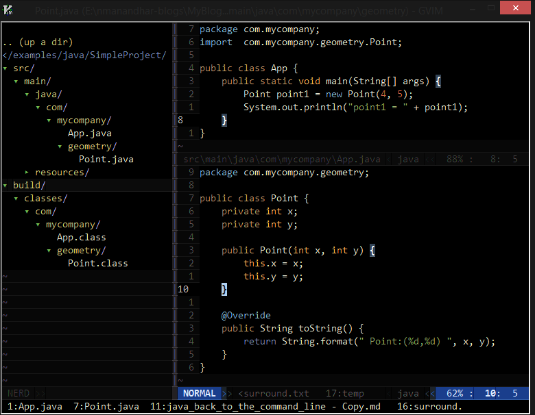

# Java Back to the Command Line Part 2 Running the Run

## Running the program
By this point you have successfully compiled the program, placing the result of
compilation to the folder build\classes directory. After the previous steps your
directory structure should look as shown below
  
  

## A Cup of Java

Just like we used javac to compiled our Java source files, we use
[Java](http://docs.oracle.com/javase/7/docs/technotes/tools/windows/java.html) command
to run our compiled Java program. 

>The java command can be used to run Java application. It starts a Java Virtual
Machine and loads the class we have specified and runs the main method of the
class. 

The general syntax for running a java program is `java [-options] class [args...]`

  
*Notes*

* The first argument without an option is the name of the class to be called.
    All remaining arguments are passed as arguments to the main method 

* The class we specify to run *MUST* have a main method with the
following signature
 
` public static void main(String[] args) `
  
This tells the JVM where to start running the application from

* We must specify the fully qualified name of the class ( without any extension) 

The general syntax of java can be found by
running java -help

 

        :::cmd
        SimpleProject>java -help

        Usage: java [-options] class [args...]
                   (to execute a class)
           or  java [-options] -jar jarfile [args...]
                   (to execute a jar file)
        where options include:
            -cp <class search path of directories and zip/jar files>
            -classpath <class search path of directories and zip/jar files>
                          A ; separated list of directories, JAR archives,
                          and ZIP archives to search for class files.
            -D<name>=<value>
                          set a system property
            -verbose:[class|gc|jni]
                          enable verbose output
            -javaagent:<jarpath>[=<options>]
                          load Java programming language agent, see java.lang.instrument

  

        Example of running java
        >java -verbose -DsystemProperty1=value  com.mycompany.App     argument1 argument2
                  |           |                         |                    |      
                  |           |                         |                    |      
                  |           |                         |                    |      
                  |           |                         |                    |      
                 options to java (if any)     fully qualiifed class   Arguments(if any)
                 should come first            name to run(required)   to pass to class

 ## A Time for Running 

 We are now ready for running. If you haven't compiled your program do so now.
 In the command line, cd to the root project directory and try running java

    :::cmd
    SimpleProject>java com.mycompany.App
    Error: Could not find or load main class com.mycompany.App

What happened? We supplied the fully qualified class name to run, our App class
has a main() method as required. So why couldn't Java run our application.
Looking at error generated we see that the java runtime could not locate the
class com.mycompany.App. To understand this we need to understand how the Java
runtime finds and loads class.

## A Time for Searching

First notice that unlike the compilation step, we are not passing the full file
path to the Java class file. Instead we are just telling it to run the class App
which is in the package com.mycompany.

One thing the JVM knows is that if it does find the  class com.mycompany.App, it
will be named App.class and be in the folder com/mycompany. And so armed with
this knowledge the JVM starts searching for it ,but where does it search?

If we think about it there must be some path where the JVM will search
, because we can't allow Java to search our whole hard drive to find
the classes it needs. In fact it turns out that there is not just a
single path but a bunch of paths where Java will search for classes it needs
during runtime. This set of paths is known as the Classpath

>:::definition
 
Classpath: A set of directories where Java will search for classes and
possibly source files

There are number of ways that we can set the classpath, ie tell the JVM where to
look for classes.
1. Default Value "." the current directory
1. CLASSPATH environment variable
1. The value of -cp or -classpath command line option
1. The Jar archive specified by the -jar option

  
1. **Default Value**   
By default (ie if you have not used option 2, 3 or 4) above , the default value
of . or the current directory is used as the classpath.We can use this to our
advantage by changing to the directory where our compiled classes are located
before running java

        :::cmd
        SimpleProject>set CLASSPATH=
        SimpleProject>cd build\classes
        SimpleProject\build\classes>java com.mycompany.App
        point1 =  Point:(4,5)

Viola! our program has finally run. In the above example we temporarily reset
any CLASSPATH environment variable to negate its effect if any. Now when we run
com.mycompany.App, Java searches for the class in the classpath( which happens
to be the current directory) and finds the class and happily runs it

2.) ** CLASSPATH Environment Variable **   

The classpath can also be set using the environment variable CLASSPATH. This
    is done when we want to specify more than one locations that JVM should
    search for. The classpath entries should be separated by ; on Windows and a
    : for Unix/Linux systems.
    Let's try it:

    :::cmd
    $>cd SimpleProject
    SimpleProject>set CLASSPATH=target/classes;build/classes
    SimpleProject>java com.mycompany.App
    point1 =  Point:(4,5)

Here we temporarily set the CLASSPATH to two diretories target/classes and
build/classes. Now Java will search in both these directories for
com.mycompany.App, finds it in build/classes directory and happily runs the
application. Notice that we can now run our Java program while staying right in
the Project directory without having to cd to build/classes directory.

If we want we can go to the build/classes and run the program like this before.
Lets run it again just for demonstration

    ::cmd
    SimpleProject>cd build\classes
    SimpleProject\build\classes>java com.mycompany.App
    Error: Could not find or load main class com.mycompany.App

Whoa? Come again!! This should not be failing. We are inside build/classes
directory and the classpath is set to the current directory by default. Moreover
we have also added build/classes to the classpath, so the JVM should be able to
find our class, right? 

WRONG! Well it turns out that the CLASSPATH environment variable overrides the
default "." directory setting of the classpath. ie The default setting is only
used if you have not set the classpath any other way. But we have also added
build/classes directory to the classpath and the JVM can use that to find our
lasses, right? Wrong again! Notice that we set the path relative to the Project
Root, and since we are inside build\classes directory, Java searches for the
class com.mycompany.App inside SimpleProject\build\classes\build\classes\
direcotry.

This points to an important conclusion. When setting the classpath,the CLASSPATH
environment variable overrides the default setting. Also setting the classpath
in the command line via -cp/-classpath option overrides the default classpath as
well as any classpath set by environment variable.

>If you are setting the classpath via CLASSPATH variable make sure that you
explicitly put a "." if you want Java to also search the current directory. 

Lets fix the issue and try again

    :::cmd
    SimpleProject>cd build\classes 
    SimpleProject\build\classes>set CLASSPATH=%CLASSPATH%;. 
    SimpleProject\build\classes>java com.mycompany.App
    point1 =  Point:(4,5)

###-classpath/-cp options 
If you looked at the output of java -help, you may have noticed that we can also
set the classpath via -cp or -classpath option.As noted earlier, any such optiso
should come before the class to run. We also hinted that the classpath set via
-cp or -classpath overrides the default value of `.` as well as the classpath
set via CLASSPATH environment variable. Lets verify that this is indeed the case

    :::cmd
    $>cd SimpleProject
    SimpleProject>set CLASSPATH=target/classes;build/classes;.
    SimpleProject>java com.mycompany.App
    point1 =  Point:(4,5)

    SimpleProject>java -cp nonExistentDirectory com.mycompany.App
    Error: Could not find or load main class com.mycompany.App

    SimpleProject>java -cp build/classes com.mycompany.App
    point1 =  Point:(4,5)

** Its really important to understand that setting the -claspath /-cp option
will override any classpath set via the CLASSPATH environment variable**

###-jar option
    We will talk more about the jar option on the next blog, where we talk about
    packaging our application

##Conclusion
   We are now able to run our application using java command. Lets recap our
   understanding till now

   * Before running our application we need to compile our classes. We compiled
   our classes using the command   
   SimpleProject> javac -d build/classes -sourcepath src/main/java src/main/java/com/mycompany/App.java

   * Once our class has been compiled we can run the application using java   
   SimpleProject>java -cp build/classes com.mycompany.App

   * The class to run must be fully qualified and contain a main method

   * When Java runs any program it searches for classes to load in a set of
   directories known as the classpath. There are various ways of setting the
   classpath and more specific option overrides any classpath set by less
   specific methods.
